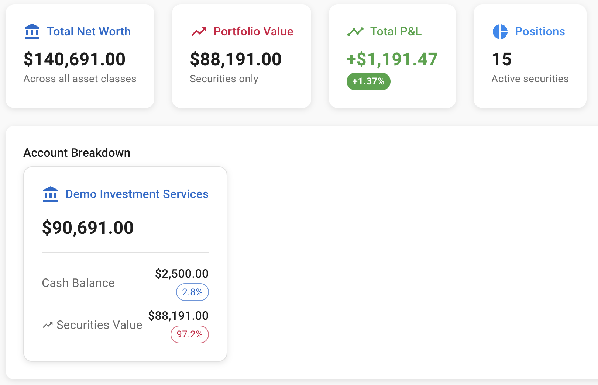
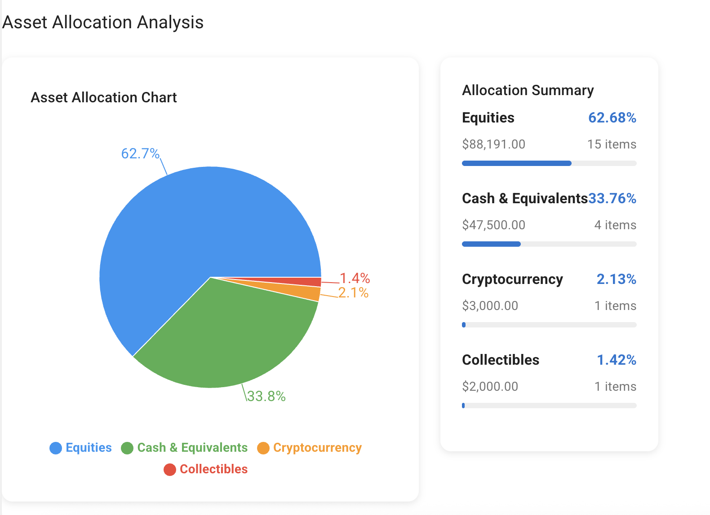
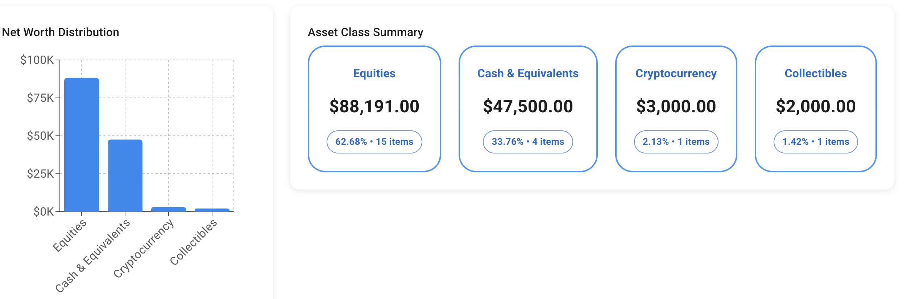

# 🏦 Treviwise - Personal Wealth Management Platform

<div align="center">


**A modern, open-source personal wealth management platform for complete financial visibility**

[](https://opensource.org/licenses/MIT)
[](https://www.python.org/downloads/)
[](https://reactjs.org/)
[](https://www.postgresql.org/)

[📊 Live Demo](https://treviwise.com) • [📖 Documentation](docs/) • [🚀 Quick Start](#-quick-start) • [🤝 Contributing](CONTRIBUTING.md)

</div>

## ✨ Features

### 💼 **Portfolio Management**
- 📈 **Real-time market data** integration with Financial Modeling Prep API
- 📊 **Multi-platform consolidation** (Schwab, IBKR, Robinhood, etc.)
- 💹 **Comprehensive P&L tracking** with weighted average cost basis
- 🎯 **Asset allocation analysis** with interactive charts

### 🌍 **Multi-Currency Support**
- 💱 **Auto currency conversion** (USD, EUR, GBP, KWD, and more)
- 🏦 **International bank account** tracking
- 🌐 **Global investment** monitoring

### 🏠 **Complete Asset Tracking**
- 💰 **Cash & bank accounts** across multiple institutions
- 🏘️ **Real estate investments** and properties
- 💎 **Collectibles & alternative investments**
- 🎨 **Personal property** with valuation tracking

### 📊 **Advanced Analytics**
- 📈 **Interactive charts** and visualizations
- 💰 **Net worth tracking** over time
- 💸 **Dividend income analysis**
- 🎯 **Performance metrics** and insights

### 🔒 **Privacy & Security**
- 🏠 **Self-hosted** - your data never leaves your control
- 🔐 **Bank-grade security** with encrypted connections
- 🛡️ **No data sharing** with third parties
- 📱 **Local-first** architecture

## 🚀 Quick Start

### Option 1: Docker (Recommended)

```bash
# Clone the repository
git clone https://github.com/aalbahar80/treviwise.git
cd treviwise

# Copy environment variables
cp backend/.env.example backend/.env
cp frontend/.env.example frontend/.env

# Edit configuration files with your settings
nano backend/.env

# Start with Docker
docker-compose up -d

# Open your browser
open http://localhost:3000
```

### Option 2: Manual Installation

```bash
# Clone and setup
git clone https://github.com/aalbahar80/treviwise.git
cd treviwise

# Run the database setup script
./scripts/setup_database.sh

# Install and run backend
cd backend
pip install -r requirements.txt
cp .env.example .env
# Edit .env with your database and API credentials
python main.py

# Install and run frontend (new terminal)
cd ../frontend
npm install
cp .env.example .env
npm start
```

**📖 For detailed setup instructions, see [SETUP.md](docs/SETUP.md)**

## 🎯 Demo Data

Want to explore Treviwise with sample data?

```bash
# Load demo portfolio (optional)
python scripts/demo_data.py
```

This adds realistic sample data including:
- 🏦 Multiple bank accounts
- 📈 15+ stock/ETF positions
- 🏘️ Real estate investments
- 💰 $125K+ sample net worth

## 📸 Screenshots

### 💼 Portfolio Dashboard


### 📊 Asset Allocation


### 📈 Performance Tracking


## 🛠️ Technology Stack

| Component | Technology | Purpose |
|-----------|------------|---------|
| **Frontend** | React 18 + Material-UI | Modern, responsive user interface |
| **Backend** | FastAPI + Python | High-performance REST API |
| **Database** | PostgreSQL 15+ | Reliable data storage with ACID compliance |
| **Charts** | Recharts | Interactive financial visualizations |
| **Market Data** | Financial Modeling Prep API | Real-time stock prices and data |

## 🏗️ Architecture

```
┌─────────────────┐    ┌─────────────────┐    ┌─────────────────┐
│   React App     │    │   FastAPI       │    │  PostgreSQL     │
│   (Frontend)    │◄──►│   (Backend)     │◄──►│   (Database)    │
│   Port 3000     │    │   Port 8000     │    │   Port 5432     │
└─────────────────┘    └─────────────────┘    └─────────────────┘
         │                        │                        │
         │                        ▼                        │
         │              ┌─────────────────┐               │
         │              │  External APIs  │               │
         └──────────────►│  (FMP, etc.)   │◄──────────────┘
                        └─────────────────┘
```

## 📚 Documentation

- **[📋 Setup Guide](docs/SETUP.md)** - Complete installation instructions
- **[🚀 Deployment](docs/DEPLOYMENT.md)** - Production deployment guide
- **[🔌 API Reference](docs/API.md)** - Backend API documentation
- **[💾 Database Schema](docs/DATABASE.md)** - Database structure and migrations
- **[🤝 Contributing](CONTRIBUTING.md)** - How to contribute to the project

## 🌟 Use Cases

### 💪 **For Power Users**
- **🏦 Wealth Management Professionals** tracking multiple client portfolios
- **📊 Active Investors** needing detailed performance analytics
- **🌍 International Users** with multi-currency requirements
- **🔒 Privacy-Conscious Users** wanting complete data control

### 🎯 **Perfect For**
- Consolidating investments across multiple brokerages
- Tracking real estate and alternative investments
- Managing family wealth and inheritance planning
- Building custom financial reporting and analytics

## 🗺️ Roadmap

### 🎯 **Version 1.1 (Next Release)**
- [ ] 📱 Mobile-responsive PWA
- [ ] 📊 Advanced performance analytics
- [ ] 🔄 Automatic bank/brokerage data import
- [ ] 📈 Goal tracking and planning tools

### 🎯 **Version 1.2 (Future)**
- [ ] 🤖 AI-powered insights and recommendations
- [ ] 📊 Custom dashboard widgets
- [ ] 🔔 Alert system for portfolio changes
- [ ] 📑 Tax reporting and optimization

### 🎯 **Version 2.0 (Long-term)**
- [ ] 👥 Multi-user support for families/advisors
- [ ] 🏢 Business/entity portfolio tracking
- [ ] 🌐 Additional market data providers
- [ ] 📊 Advanced financial planning tools

## 🤝 Contributing

We welcome contributions! Whether you're:

- 🐛 **Reporting bugs**
- 💡 **Suggesting features**
- 📖 **Improving documentation**
- 💻 **Contributing code**

Please read our [Contributing Guide](CONTRIBUTING.md) to get started.

### 🎯 **Good First Issues**
- [ ] Add support for new currencies
- [ ] Improve mobile responsiveness
- [ ] Add more chart types
- [ ] Enhance documentation
- [ ] Write unit tests

## 📄 License

This project is licensed under the MIT License - see the [LICENSE](LICENSE) file for details.

## 🙏 Acknowledgments

- **[Financial Modeling Prep](https://financialmodelingprep.com/)** for market data API
- **[Material-UI](https://mui.com/)** for the beautiful React components
- **[FastAPI](https://fastapi.tiangolo.com/)** for the high-performance backend framework
- **[Recharts](https://recharts.org/)** for the interactive chart library

## 💬 Community & Support

- **[GitHub Issues](https://github.com/aalbahar80/treviwise/issues)** - Bug reports and feature requests
- **[Discussions](https://github.com/aalbahar80/treviwise/discussions)** - Community help and ideas
- **[Documentation](docs/)** - Comprehensive guides and references

---

<div align="center">

**Built with ❤️ for the personal finance community**

[⭐ Star this project](https://github.com/aalbahar80/treviwise) if you find it useful!

</div>